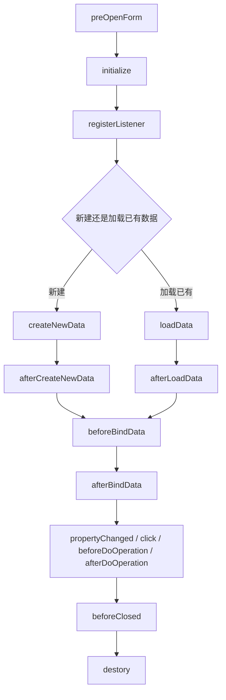
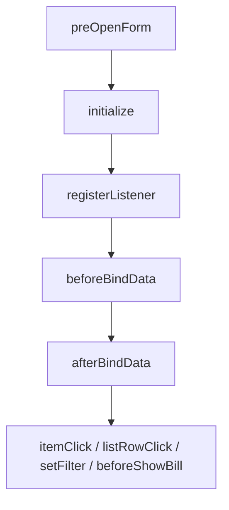
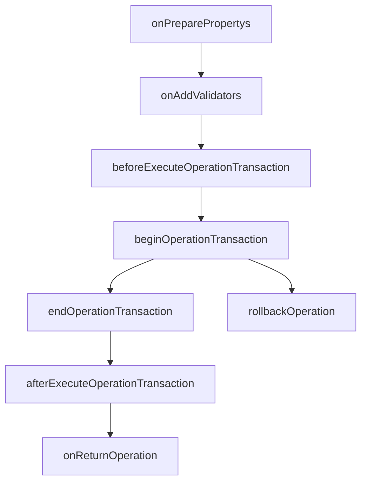
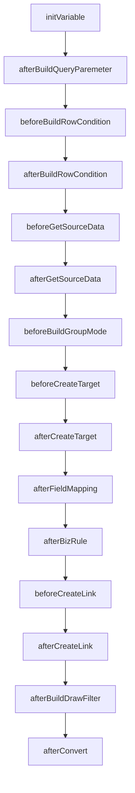
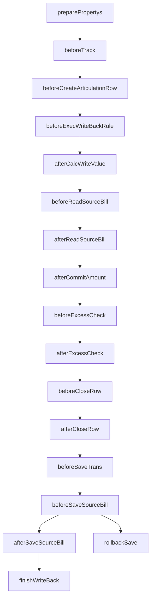

# 插件事件生命周期图

## TL;DR

- 适用：你已经命中插件类型，但不确定事件触发顺序、该把逻辑放在哪个阶段时，先读本页。
- 先抓：先看对应插件类型的生命周期图，再看“放置策略速查”。
- 边界：本页只解决“事件先后顺序 + 适合放什么逻辑”；具体方法签名、原生事件全集仍回各插件文档确认。
- 跳转：
  - 表单 / 单据：`plugin-base.md`、`plugin-form.md`、`plugin-bill.md`
  - 列表：`plugin-base.md`、`plugin-list.md`
  - 操作：`plugin-base.md`、`plugin-operation.md`
  - 转换：`plugin-botp.md`
  - 反写：`plugin-writeback.md`

## 一页总原则

- `initialize`：做轻量初始化；不要注册监听，不要做 UI 可见性/启用状态逻辑。
- `registerListener`：只注册监听；不要依赖已绑定的数据，不要在这里 `model.getValue(...)`。
- `createNewData` / `loadData` / `afterLoadData`：做数据包初始化、补字段、加载后整理。
- `beforeBindData` / `afterBindData`：处理绑定前后和 UI 状态；不要在绑定阶段改数据对象。
- 操作插件：先区分事务前、事务中、事务后；明确规则优先放校验器。
- 转换 / 反写插件：先看当前是在“转换阶段”还是“回写阶段”，再判断事件位置。

## 表单 / 单据插件

单据插件继承动态表单生命周期；已有单据更常落在 `loadData/afterLoadData`，新建单据更常落在 `createNewData/afterCreateNewData`。

### 放置策略

| 事件 | 适合放什么 | 不要放什么 |
|---|---|---|
| `initialize` | 轻量初始化、上下文准备 | 监听注册、UI 状态逻辑 |
| `registerListener` | `add*Listener`、监听器注册 | `model.getValue(...)`、联动赋值 |
| `createNewData` | 新建默认值、数据包初始化 | 控件可见性 / 启用状态 |
| `afterLoadData` | 已有单据加载后整理 | 事务级校验 |
| `beforeBindData` / `afterBindData` | UI 刷新前后、界面状态控制 | `setValue(...)`、改数据包 |
| `propertyChanged` | 字段联动、即时补值 | 跨事务级复杂状态流转 |

## 列表插件

列表插件没有 `createNewData/loadData` 这一段，重点是列表绑定前后和列表交互事件。

### 放置策略

| 事件 | 适合放什么 | 不要放什么 |
|---|---|---|
| `registerListener` | 列表按钮、行点击、超链接等监听注册 | 依赖已选中行的数据处理 |
| `beforeBindData` | 绑定前过滤准备 | 直接改行数据对象 |
| `afterBindData` | 列表展示、过滤容器状态协同 | 批量持久化写库 |
| `itemClick` / `listRowClick` | 批量动作入口、打开页面、交互编排 | 事务内核心业务逻辑 |

## 操作插件

操作插件运行在服务端事务链路，要先分清“字段准备”“校验”“事务内处理”“事务后处理”。

### 放置策略

| 事件 | 适合放什么 | 不要放什么 |
|---|---|---|
| `onPreparePropertys` | 补操作所需字段 | 业务校验、状态写回 |
| `onAddValidators` | 注册校验器、前置阻断 | 事务内数据修改 |
| `beforeExecuteOperationTransaction` | 最后整理、轻量兜底校验 | 大量规则校验堆叠 |
| `beginOperationTransaction` / `endOperationTransaction` | 事务内同步处理、状态更新 | 事务后通知类逻辑 |
| `afterExecuteOperationTransaction` | 消息通知、日志、外部后续动作 | 再修改主单据事务数据 |

## 转换插件

转换插件关注源单取数、目标单创建、字段映射和关联关系生成。先区分“下推/选单业务动作”还是“转换规则扩展”。

### 放置策略

| 事件 | 适合放什么 | 不要放什么 |
|---|---|---|
| `initVariable` | 识别下推/选单上下文 | 直接写目标单字段 |
| `beforeGetSourceData` / `afterGetSourceData` | 源单过滤、补第三方数据 | 映射完成后的兜底修正 |
| `afterFieldMapping` | 映射后补值 | 过早取消关联 |
| `afterBizRule` | 规则执行后的最终修正 | 大量外部 IO |
| `beforeCreateLink` / `afterCreateLink` | 调整上下游关联关系 | 随意取消导致追踪断裂 |

## 反写插件

反写插件是 BOTP 回写阶段的专用链路，不等于一般意义上的“更新关联实体”。

### 放置策略

| 事件 | 适合放什么 | 不要放什么 |
|---|---|---|
| `preparePropertys` / `beforeReadSourceBill` | 补字段准备 | 直接做反写结果修正 |
| `beforeExecWriteBackRule` / `afterCalcWriteValue` | 控制规则是否执行、修正反写值 | 事务补偿逻辑 |
| `beforeExcessCheck` / `afterExcessCheck` | 超额校验、提示策略 | 一刀切取消全部检查 |
| `beforeSaveTrans` / `rollbackSave` | 外部补偿、第三方一致性闭环 | 忽略失败回滚 |
| `finishWriteBack` | 释放网控、缓存句柄等资源 | 留资源不释放 |

## 常见错位速查

| 误放位置 | 常见后果 | 正确位置 |
|---|---|---|
| 在 `initialize()` 中注册监听或写 UI 状态 | 生命周期过早，逻辑失效或错时 | `registerListener` / `afterBindData` |
| 在 `registerListener` 中读模型值 | 数据尚未绑定 | `afterBindData` / `propertyChanged` |
| 在 `beforeBindData` / `afterBindData` 中 `setValue(...)` | 绑定阶段改数据，容易出错 | `createNewData` / `afterLoadData` / `propertyChanged` / 保存前 |
| 在 UI 插件中承担事务级校验或状态流转 | 与服务端状态机冲突 | 操作插件 |
| 把“业务上说反写”直接理解成反写插件 | 场景误判 | 先判断是不是普通实体更新，只有明确插件语义时才走反写插件 |

## 继续读取建议

- 只是不确定“该放哪个事件”：本页足够。
- 要确认方法签名：回 [plugin-base.md](plugin-base.md) 或对应原生插件文档。
- 要确认具体控件/字段联动做法：回对应 `form-utils.md`、`plugin-form.md`、`plugin-bill.md`。
- 要确认转换 / 反写事件细节：回 `plugin-botp.md`、`plugin-writeback.md`。
