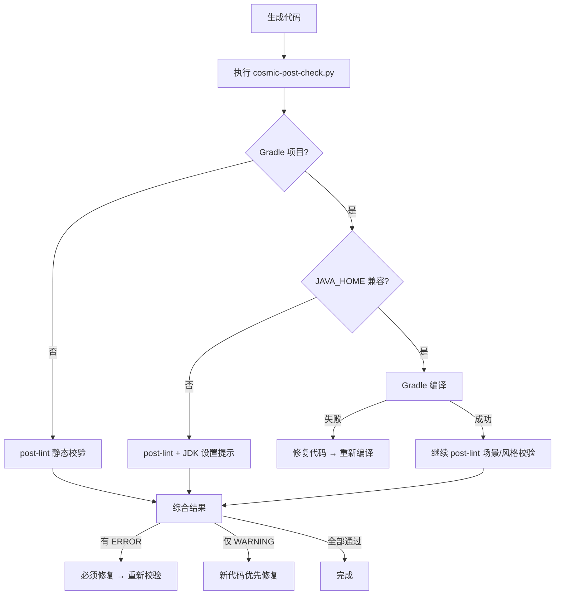

# 生成后自动校验规则 (Post-Check)

`cosmic-post-check.py` 是代码生成后的**统一检查入口**，自动选择最佳检查策略：

- **Gradle 项目** → 先执行 `./gradlew :module:compileJava` 真实编译，编译成功后继续执行 `cosmic-post-lint.py` 场景/风格校验
- **非 Gradle 项目** → 直接回退到 `cosmic-post-lint.py` 静态校验（A/B/C 三层规则）

## 触发条件

**每次 AI 生成或修改 `.java` 文件后，自动触发**，无需用户手动请求。

## 默认执行命令

```bash
python3 <SKILL_ROOT>/scripts/cosmic-post-check.py <生成的文件或目录> --fix-hint
```

脚本自动判断：
1. 从目标文件路径**向上查找** `build.gradle` + `settings.gradle` 共存的目录
2. 找到 → Gradle 编译（解析 `settings.gradle` 确定模块，执行 `./gradlew :module:compileJava`）
3. 未找到 → 回退到 `cosmic-post-lint.py --fix-hint` 静态校验

## 严格模式（仅 post-lint 回退时生效）

当用户明确要求"严格校验""模板升级治理""补事实来源留痕"时，再追加严格模式：

```bash
python3 <SKILL_ROOT>/scripts/cosmic-post-check.py <生成的文件或目录> --fix-hint --strict
```

说明：

- `--strict` 仅在非 Gradle 回退到 post-lint 时生效，额外检查 **C 层** 验证来源注释。
- Gradle 编译本身不区分严格/宽松——编译器检查的就是全部约束。

## 校验流程



> **注意**：Gradle 编译成功后仍会串联执行 post-lint 的场景/风格校验（SCENE/STYLE/RESOURCE 等规则），编译器不检测这些业务约束。最终以两者综合结果为准。

## 问题级别处理策略

| 级别 | 对应层级 | 处理方式 | 是否阻断 |
|------|----------|----------|----------|
| ❌ ERROR | A 层硬约束 | 必须修复，根据 fix-hint 立即调整代码 | **是** |
| ⚠️ WARNING | B 层推荐项 | 新代码优先修复；历史代码可结合上下文评估是否本次顺手收敛 | 否 |
| 💡 INFO | C 层治理项 | 记录为治理建议，适合模板升级或批量重构 | 否 |

## 规则 ID 与层级映射

| ID 前缀 | 默认层级 | 类别 | 来源文件 |
|----------|----------|------|----------|
| `SCENE-*` | A / B | 场景错配 | anti-patterns.md |
| `STYLE-*` | A / B | 编码风格 | coding-preferences.md |
| `RESOURCE-*` | A / B | 资源管理 | coding-preferences.md |
| `VERIFY-*` | C | 验证来源留痕 | coding-preferences.md |

补充说明：

- SDK 类名、方法签名和 `@Override` 正确性改为**事前**通过 `cosmic-api-knowledge.py detail/search`、模板、cheat-sheet 或编译验证，不再由 post-lint 的 `API-*` 规则兜底。
- `SCENE-*` 与 `RESOURCE-*` 中既有明显硬错误，也可能包含偏治理的 warning；解释结果时要结合上下文，不要机械套标签。
- 需要按 A 层（ERROR）处理的 SCENE/STYLE/RESOURCE 规则 ID，统一定义在 [a-layer-rules.json](a-layer-rules.json)（单一可信源），`cosmic-post-lint.py` 在运行时自动加载。如需新增/移除 A 层规则，直接编辑该 JSON 文件即可，无需改脚本代码。
- `VERIFY-*` 默认不作为当前交付阻断项；只有在 `--strict` 或用户明确要求治理时，才应提高关注度。

## 修复示例

当收到如下 lint 报告时：

```text
❌ L 31 [SCENE-001] 操作插件中调用 this.getView()
   > this.getView().showMessage("处理完成");
   💊 修复: 操作插件无 UI 上下文，改为 addErrorMessage / 日志 / 返回操作结果
```

AI 应：

1. 将 UI 交互逻辑移出操作插件，或改为操作结果/日志方式表达。
2. 重新执行 lint，确认该 `ERROR` 消失
3. 检查修复是否引入新的场景错配或资源问题

## 对历史项目的解释口径

- 出现 `WARNING` 时，不要直接说"代码错误"；优先判断它是：
  - 新代码应该采用的默认写法
  - 历史项目当前可接受的兼容写法
  - 适合本次顺手治理的低风险改动
- 出现 `INFO` 时，默认按"后续治理建议"表述，不要阻断当前任务。

## 重试上限

- 单个文件最多执行 **3 轮** "修复 → 复检" 循环
- 3 轮后仍有 `ERROR` 未消除，停止自动修复，向用户报告剩余问题清单并请求人工介入
