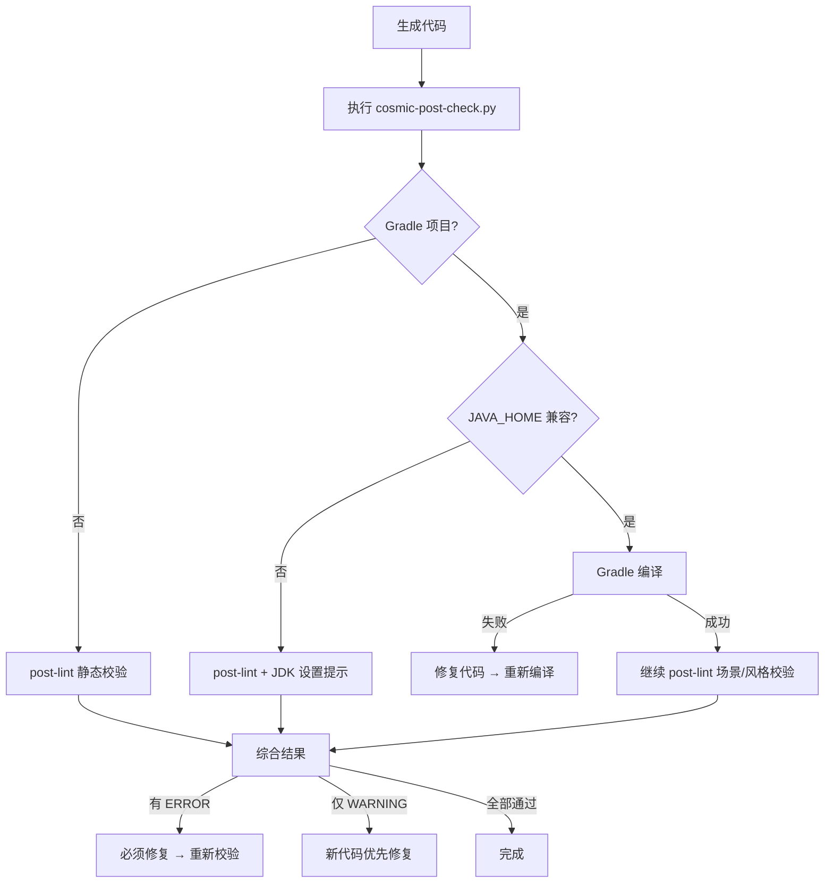

# 生成后自动校验规则 (Post-Check)

`cosmic-post-check.py` 是代码生成后的**统一检查入口**，自动选择最佳检查策略：

- **Gradle 项目** → 先执行 `./gradlew :module:compileJava` 真实编译，编译成功后继续执行 `cosmic-post-lint.py` 场景/风格校验
- **非 Gradle 项目** → 直接回退到 `cosmic-post-lint.py` 静态校验（A/B/C 三层规则）

## 触发条件

生成或修改 Java 逻辑、平台调用、事件签名或资源管理时，使用本入口完成受影响范围的编译与场景/资源检查；当前差异已完成等价检查时不重复运行。仅注释或格式变化检查差异即可。必要检查属于本地实现任务，不逐次请求批准；业务行为变化再运行相应测试，不固定追加全模块测试。

## 默认执行命令

以下命令中的 `python3` 表示当前已核实的 Python 启动器；Windows 可用 `py -3` 或解释器绝对路径，优先进程参数数组传参。Gradle 使用项目自带 wrapper：Windows 为 `gradlew.bat`，macOS/Linux 为 `./gradlew`；检查脚本已按平台选择，不要求安装 Bash。

仅运行检查所需解析依赖缺失时，在合适的项目或隔离环境按锁定版本安装最小依赖：

```bash
python3 -m pip install -r <SKILL_ROOT>/requirements.txt
```

```bash
python3 <SKILL_ROOT>/scripts/cosmic-post-check.py <生成的文件或目录> --fix-hint
```

脚本自动判断：
1. 从目标文件路径**向上查找** `build.gradle` + `settings.gradle` 共存的目录
2. 找到且 JDK 兼容 → Gradle 编译（解析 `settings.gradle` 确定模块，执行 `./gradlew :module:compileJava`）
3. Gradle 成功 → 对同一目标继续执行 `cosmic-post-lint.py`
4. 未找到 Gradle 项目或 JDK 不兼容 → 直接执行 `cosmic-post-lint.py`

检查不会修改 `gradlew` 权限；POSIX 下 wrapper 不可执行时使用 `sh gradlew` 调用。

JDK 兼容判断先读取项目声明的 `systemProp.jdk.version`、`systemProp.jdk_version` 或 `sourceCompatibility`，并区分构建启动 JVM、编译目标与部署运行 JVM。已有 JDK8 项目不因 wrapper 版本或新版公告被自动升级；实际启动 JVM 还须满足所用 wrapper 的要求，不能把 `sourceCompatibility=8` 当作 wrapper 必能在 JDK8 启动的证明。

[官方 JDK 调整公告](https://vip.kingdee.com/knowledge/specialDetail/218022218066869248?category=218024718795190528&id=767850225473553920&type=Knowledge&productLineId=29&lang=zh-CN)（更新于 2026-03-17 09:55）说明：苍穹 8.0 支持 JDK17 且为最后兼容 JDK8 的版本，8.0 公有云使用 JDK17、私有云仍可用 JDK8；未来 9.0+ 最低 JDK17。据此核对目标版本与部署形态，不默认“Java 8+”覆盖所有苍穹项目，不擅改旧项目构建目标或取消既有兼容性检查。脚本的 JDK 推断只是检查策略选择，不能代替平台兼容性结论。

## 严格模式（仅影响 post-lint 阶段）

当用户明确要求"严格校验""模板升级治理""补事实来源留痕"时，再追加严格模式：

```bash
python3 <SKILL_ROOT>/scripts/cosmic-post-check.py <生成的文件或目录> --fix-hint --strict
```

说明：

- `--strict` 在 post-lint 阶段额外检查 **C 层** 验证来源注释；Gradle 成功后的串联 lint 同样生效。
- Gradle 编译本身不区分严格/宽松——编译器检查的就是全部约束。

## JSON 输出

追加 `--json` 时，stdout 只输出一个可独立解析的 JSON 文档；Gradle 输出、阶段提示和 JDK 提示写入 stderr。Gradle 失败，或 Gradle 成功后 lint 发现 `ERROR`，都会返回非零状态。

## 校验流程


```mermaid
graph TB
    A[生成代码] --> B[执行 cosmic-post-check.py]
    B --> C{Gradle 项目?}
    C -->|否| D[post-lint 静态校验]
    C -->|是| E{JAVA_HOME 兼容?}
    E -->|否| F[post-lint + JDK 设置提示]
    E -->|是| G[Gradle 编译]
    G -->|失败| H[修复代码 → 重新编译]
    G -->|成功| I[继续 post-lint 场景/风格校验]
    I --> J[综合结果]
    D --> J
    F --> J
    J -->|有 ERROR| K[必须修复 → 重新校验]
    J -->|仅 WARNING| L[新代码优先修复]
    J -->|全部通过| M[完成]
```

> **注意**：Gradle 编译成功后仍会串联执行 post-lint 的场景/风格校验（SCENE/STYLE/RESOURCE 等规则），编译器不检测这些业务约束。最终以两者综合结果为准。

## 问题级别处理策略

| 级别 | 对应层级 | 处理方式 | 是否阻断 |
|------|----------|----------|----------|
| ❌ ERROR | A 层硬约束 | 必须修复，根据 fix-hint 立即调整代码 | **是** |
| ⚠️ WARNING | B 层推荐项 | 新代码优先修复；历史代码可结合上下文评估是否本次顺手收敛 | 否 |
| 💡 INFO | C 层治理项 | 记录为治理建议，适合模板升级或批量重构 | 否 |

## 规则 ID 与层级映射

| ID 前缀 | 默认层级 | 类别 | 来源文件 |
|----------|----------|------|----------|
| `SCENE-*` | A / B | 场景错配 | anti-patterns.md |
| `STYLE-*` | A / B | 编码风格 | coding-preferences.md |
| `RESOURCE-*` | A / B | 资源管理 | coding-preferences.md |
| `VERIFY-*` | C | 验证来源留痕 | coding-preferences.md |

补充说明：

- SDK 类名、方法签名和 `@Override` 在实现前用目标项目实际依赖、匹配目标版本的 SDK/JAR/Javadoc 确认；`cosmic-api-knowledge.py detail/search`、模板和 cheat-sheet 用于定位候选，编译也须使用匹配目标的依赖。复用本次已确认的证据，不再由 post-lint 的 `API-*` 规则兜底。
- `SCENE-*` 与 `RESOURCE-*` 中既有明显硬错误，也可能包含偏治理的 warning；解释结果时要结合上下文，不要机械套标签。
- 需要按 A 层（ERROR）处理的 SCENE/STYLE/RESOURCE 规则 ID，统一定义在 [a-layer-rules.json](../references/rules/a-layer-rules.json)（单一可信源），`cosmic-post-lint.py` 在运行时自动加载。如需新增/移除 A 层规则，直接编辑该 JSON 文件即可，无需改脚本代码。
- `RESOURCE-004` 认可直接 `close()`、`DataSet` try-with-resources、返回/后续 DataSet 消费，以及词法作用域覆盖声明的 `try (AlgoContext ... = Algo.newContext())`；把上下文创建放在别的方法里不作为静态豁免。
- `STYLE-015` 仅对可证明的有界主键游标分页放行：同一方法内必须有 `id > cursor`、`id asc`、有限页大小，并从本页末行推进同一 cursor；普通循环查询仍是 ERROR。
- `VERIFY-*` 默认不作为当前交付阻断项；只有在 `--strict` 或用户明确要求治理时，才应提高关注度。

## 修复示例

当收到如下 lint 报告时：

```text
❌ L 31 [SCENE-001] 操作插件中调用 this.getView()
   > this.getView().showMessage("处理完成");
   💊 修复: 操作插件无 UI 上下文，改为 addErrorMessage / 日志 / 返回操作结果
```

AI 应：

1. 将 UI 交互逻辑移出操作插件，或改为操作结果/日志方式表达。
2. 重新执行 lint，确认该 `ERROR` 消失
3. 检查修复是否引入新的场景错配或资源问题

## 对历史项目的解释口径

- 出现 `WARNING` 时，不要直接说"代码错误"；优先判断它是：
  - 新代码应该采用的默认写法
  - 历史项目当前可接受的兼容写法
  - 适合本次顺手治理的低风险改动
- 出现 `INFO` 时，默认按"后续治理建议"表述，不要阻断当前任务。

## 证据驱动的停止条件

- 每轮修复后比较编译/lint findings、错误位置、失败类型和测试结果；只有产生可区分的新证据，且修复仍在当前任务契约内，才继续自动修复。
- 同一错误重复且无新根因证据，或修复引入新增错误时，停止沿当前假设继续改写；先核对失败证据、定位新增影响，必要时撤回本轮可归因改动，并继续范围内的只读取证与已授权本地检查。错误数量不降本身不是结束任务的依据；获得支持下一步的新证据且仍在授权范围内时继续修复。
- 修复依赖尚未确认的 SDK/元数据事实时，只暂停依赖该事实的改写并继续取证。下一步将越出批准范围、缺少外部授权，或涉及未批准的破坏性动作、高风险契约变更时，暂停相关动作并报告最小待决策项；不阻断独立且已授权的工作。
- 只剩无法由当前证据判定的 `ERROR` 时，报告已尝试动作、最后证据、阻塞项和最小人工决策；不按固定轮数假装完成或强行改写。
