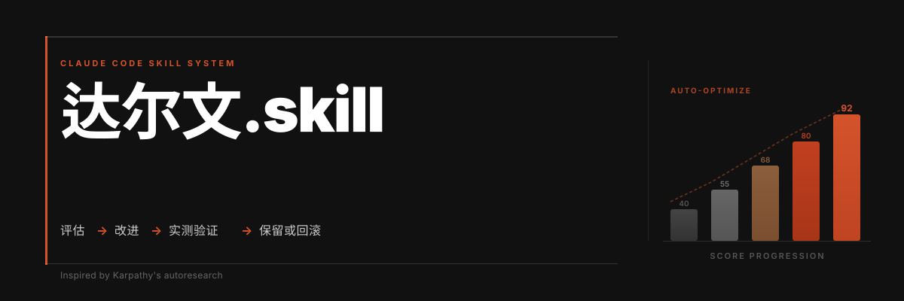
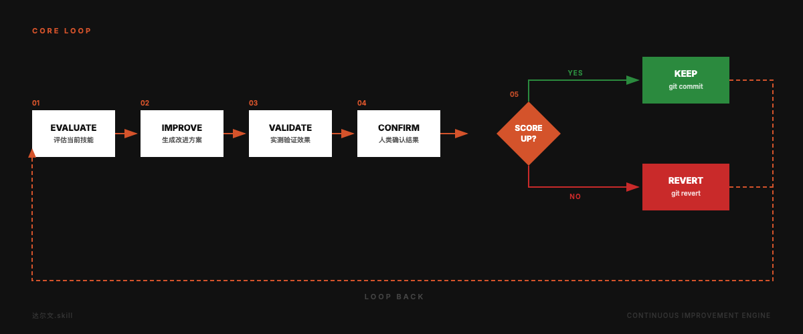
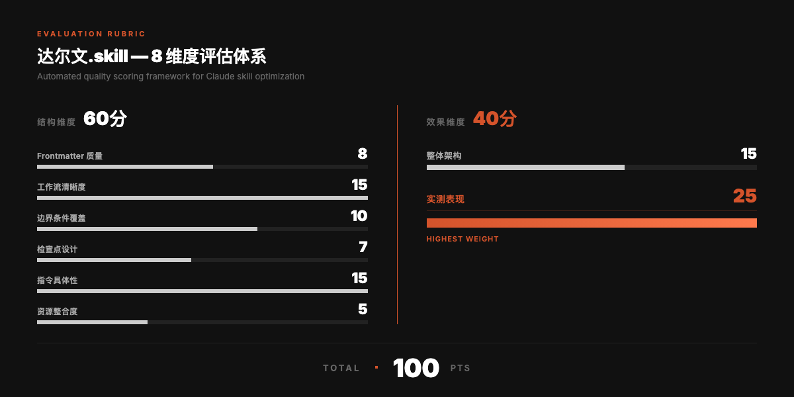
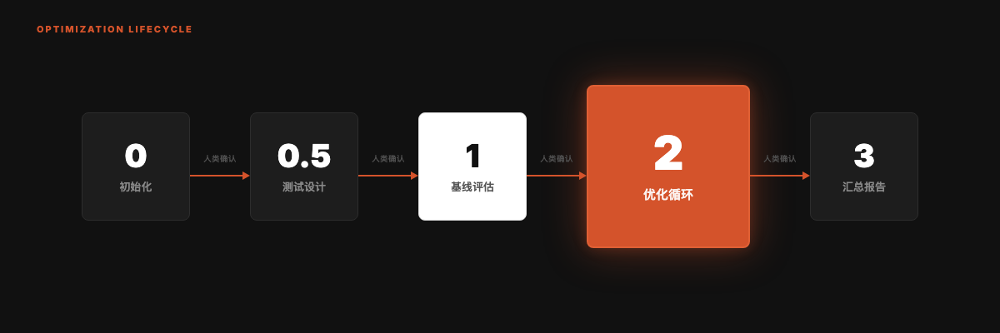
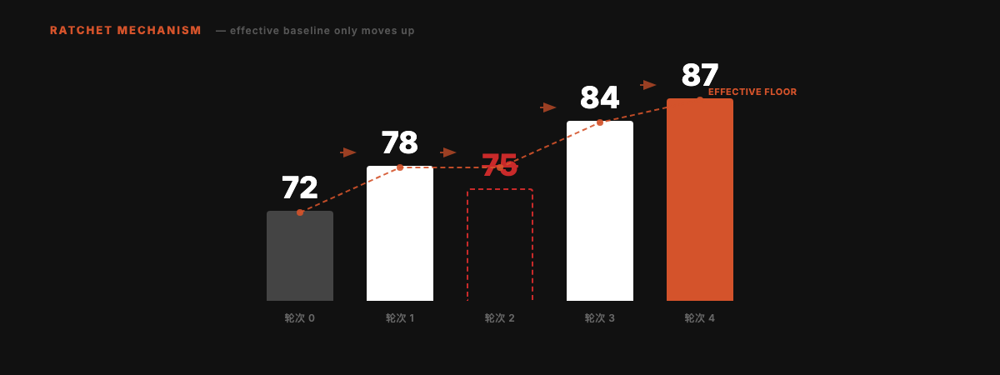

<div align="right">

**[English](README_EN.md)** | 中文

</div>



<div align="center">

# 达尔文.skill

**像训练模型一样优化你的 Agent Skills。**

受 [Andrej Karpathy 的 autoresearch](https://github.com/karpathy/autoresearch) 启发，将自主实验循环从模型训练搬到 Skill 优化领域。一个只能向前转的棘轮。

[](#许可证)
[](https://skills.sh)
[](https://skills.sh)

```
npx skills add alchaincyf/darwin-skill
```

</div>

---

## 核心循环

确认具体问题 → 核对相关能力 → 精确修改 → 验证结果 → 保留或恢复本轮改动。

当前执行合同见 [SKILL.md](SKILL.md)。用户选择逐阶段审核时保留检查点；已授权连续优化无需逐项重复确认。Git、发布和付费动作仍须有对应授权。

## 优化哪些内容

Skill 包含入口，以及承载能力的参考资料、脚本、模板和资产。动手前记录触发、路由、输入输出、授权、隐私、恢复和验证能力；为精确目标保存基线，保留已有改动。

| 原则 | 执行方式 |
| --- | --- |
| 可归因的修改 | 一次处理一个可独立验证的问题，必要时同时修改相关文件。 |
| 按影响验证 | 措辞修订核能力和引用；行为变化用代表性案例；脚本修复留下最小回归。 |
| 证据先于评分 | 只有改善证据且能力、正确性和权限无回退才保留；分数不能替代这些条件。 |
| 独立复核 | 核心用途、授权或复杂恢复改变时使用可用独立评审；不可用时注明，与实际执行模式分开记录。 |
| 精确恢复 | 有回退或缺乏改善依据时只恢复本轮目标差异，不覆盖无关资产，Git 动作按授权执行。 |

## 可选评测

需要可比分数或批量记录时，按需读取 [评测约定](references/evaluation-contract.md) 和 [评分细则](references/rubric-detail.md)。总分100、结构60/效果40是一种可选口径，不是完成目标。已复现的脚本修复或小幅措辞修订不必为了形式打分。

实际执行任务并检查结果才记 `full_test`；只推演行为记 `dry_run`。独立复核、操作系统覆盖、真实服务覆盖和实际 token 收益分别需要证据，不能互相替代；未测量的数据保持未测量。

## 优化流程

1. 明确可维护源、授权范围、已有改动和可恢复基线。
2. 复现问题，或用代表性案例核对相互冲突的指令。
3. 修改必要入口或支持资源，不静默删除能力。
4. 运行相关检查；影响需要时使用独立复核。
5. 有改善证据且无回退则保留，否则只恢复本轮差异。
6. 交付路径、差异、验证、限制和恢复方式。仅为剩余具体问题或用户指定范围继续，不为分数和轮次虚构工作。

批量与逐阶段审核细节见 [optimization-loop.md](references/optimization-loop.md)。评测资产默认保存在任务产物目录；精确暂存和提交按已有 Git 授权执行。

## 设计图例

以下保留项目早期的评分流程图。图中的固定维度、Human Confirm、git commit/revert 标签不覆盖上述现行合同。保留决定仍取决于证据和能力保留，不能只看分数；示例数字不是实际优化结果。

<details>
<summary>查看原始循环、评分、阶段和棘轮示意图</summary>






</details>

---

## 快速开始

```bash
npx skills add alchaincyf/darwin-skill
```

安装后在任何支持 Skill 的 Agent 工具中说「优化所有skills」或「优化某个skill」就行。

离线安装时，使用已取得且审核过的完整 Skill 目录，保留 `SKILL.md`、`references/`、`scripts/` 和所需资产，并放入当前 Agent 声明的 Skill 目录。目录位置由宿主配置决定，不固定到 Claude 或某个操作系统；仅复制 `SKILL.md` 会丢失引用和执行能力。

---

## 设计灵感

这个项目的设计直接受 **Andrej Karpathy 的 [autoresearch](https://github.com/karpathy/autoresearch)** 启发。

采用其中的实验思路：**用证据判断改进，保留能力，精确恢复失败修改。**

---

## 关于作者

| | |
|:---|:---|
| 🌐 官网 | [bookai.top](https://bookai.top) · [huasheng.ai](https://www.huasheng.ai) |
| 𝕏 Twitter | [@AlchainHust](https://x.com/AlchainHust) |
| 📺 B站 | [花叔](https://space.bilibili.com/14097567) |
| ▶️ YouTube | [@Alchain](https://www.youtube.com/@Alchain) |
| 📕 小红书 | [花叔](https://www.xiaohongshu.com/user/profile/5abc6f17e8ac2b109179dfdf) |
| 💬 公众号 | 微信搜「花叔」 |

---

## 许可证

MIT

---

<div align="center">

**[女娲](https://github.com/alchaincyf/nuwa-skill)** 造 Skill。<br>
**达尔文** 让 Skill 进化。<br><br>
*只保留改进，时间就站在你这边。*

<br>

MIT License © [花叔 Huashu](https://github.com/alchaincyf)

</div>
