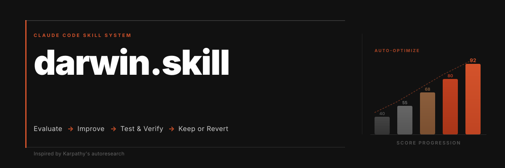
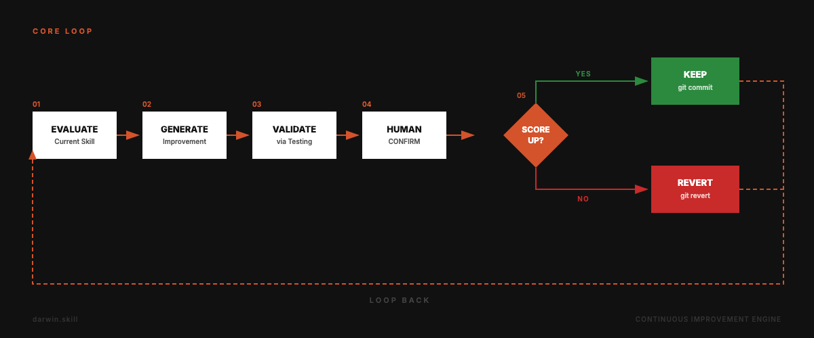
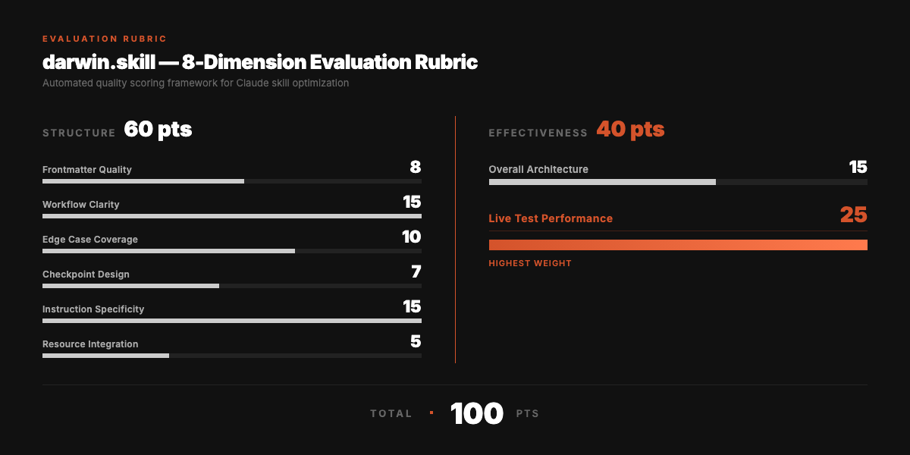
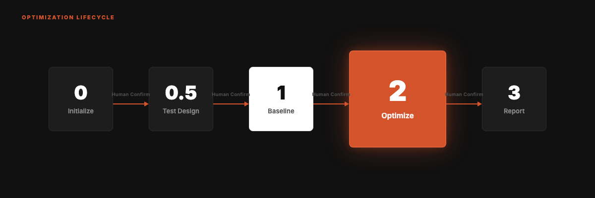
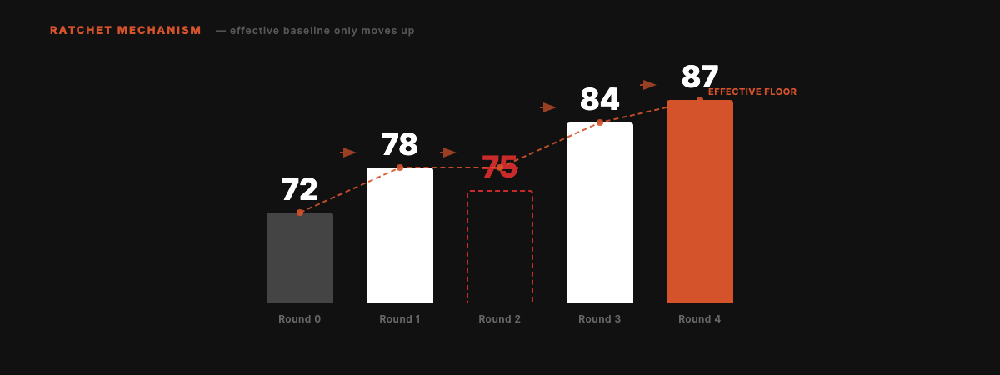

<div align="right">

English | **[中文](README.md)**

</div>



<div align="center">

# darwin.skill

**Optimize your Agent Skills the way you train models.**

Inspired by [Karpathy's autoresearch](https://github.com/karpathy/autoresearch). Autonomous experiment loops, applied to skill optimization. A ratchet that only turns forward.

[](#license)
[](https://skills.sh)
[](https://skills.sh)

```
npx skills add alchaincyf/darwin-skill
```

</div>

---

## The Core Loop

Identify a concrete problem → preserve the relevant capabilities → make a scoped change → verify the result → keep or restore that change.

The current execution contract is [SKILL.md](SKILL.md). Follow user-selected review gates; authorized continuous work proceeds without repeated confirmation. Git, publication, and paid operations still require their corresponding authorization.

## What Gets Optimized

A Skill includes its entrypoint and the references, scripts, templates, and assets that implement its capabilities. Before editing, record triggers, routing, inputs and outputs, authorization, privacy, recovery, and verification. Change only the files needed to fix the confirmed problem, with a baseline that preserves existing work.

| Principle | Application |
| --- | --- |
| Scoped experiments | One independently verifiable problem may require several related files. |
| Proportionate validation | Compare capabilities and references for wording changes; use representative cases for behavior changes and regression tests for scripts. |
| Evidence before scores | Keep changes only with improvement evidence and no capability, correctness, or permission regression. |
| Independent review | Use an available independent reviewer for core-purpose, authorization, or complex recovery changes. Record unavailable review separately from execution mode. |
| Precise recovery | Restore only the current change if it regresses or lacks evidence; preserve unrelated work and respect Git authorization. |

## Optional Evaluation

Use the [evaluation contract](references/evaluation-contract.md) and [rubric](references/rubric-detail.md) when comparable scores or batch records are useful. A 100-point rubric with a 60/40 structure/effectiveness split is an option, not a completion target. No score is needed for a demonstrated script fix or a scoped wording correction.

`full_test` means the task was actually executed and its result checked; predicted behavior is `dry_run`. Independent review, operating-system coverage, real-service coverage, and measured token savings are separate claims that each need evidence. Missing measurements stay unavailable.

## The Optimization Cycle

1. Identify the maintainable source, authorized scope, existing changes, and a recoverable baseline.
2. Reproduce the problem or compare the conflicting instructions against representative cases.
3. Edit the necessary entrypoint or supporting resources without silently dropping capabilities.
4. Run relevant checks and obtain independent review when the impact requires it.
5. Keep an evidence-backed improvement without regression; otherwise restore only this round's changes.
6. Deliver paths, differences, verification, limitations, and recovery guidance. Continue only for a remaining concrete problem or the user's requested scope; scores and round counts are not reasons to invent work.

Batch and staged-review details are in [optimization-loop.md](references/optimization-loop.md). Evaluation artifacts belong in the task output directory unless the user requests otherwise. Git staging and commits follow existing task authorization.

## Design Illustrations

The original diagrams below illustrate the project's early scoring workflow. Their fixed dimensions, Human Confirm steps, and git commit/revert labels do not override the current contract above. Keep/revert decisions require evidence and capability preservation; a higher score alone is insufficient. The sample numbers are illustrative, not measured optimization results.

<details>
<summary>Original loop, rubric, lifecycle, and ratchet diagrams</summary>






</details>

---

## Quick Start

```bash
npx skills add alchaincyf/darwin-skill
```

After installation, tell your agent: "optimize all skills" or "optimize [skill-name]". Works with any tool that supports the SKILL.md format.

For offline installation, use an acquired and reviewed complete Skill directory, retaining `SKILL.md`, `references/`, `scripts/`, and required assets. Place it in the current agent's configured Skill directory; do not assume a Claude path or a particular operating system. Copying only `SKILL.md` loses referenced guidance and executable capabilities.

---

## Design Inspiration

Directly inspired by **Andrej Karpathy's [autoresearch](https://github.com/karpathy/autoresearch)**.

The experimental approach informs this Skill: **judge improvements with evidence, preserve capabilities, and precisely restore unsuccessful changes.**

---

## About the Author

| | |
|:---|:---|
| 🌐 Website | [bookai.top](https://bookai.top) · [huasheng.ai](https://www.huasheng.ai) |
| 𝕏 Twitter | [@AlchainHust](https://x.com/AlchainHust) |
| 📺 Bilibili | [花叔](https://space.bilibili.com/14097567) |
| ▶️ YouTube | [@Alchain](https://www.youtube.com/@Alchain) |
| 📕 Xiaohongshu | [花叔](https://www.xiaohongshu.com/user/profile/5abc6f17e8ac2b109179dfdf) |
| 💬 WeChat | Search "花叔" |

---

## License

MIT

---

<div align="center">

**[Nuwa](https://github.com/alchaincyf/nuwa-skill)** creates skills.<br>
**Darwin** makes them evolve.<br><br>
*Keep only improvements. Time is on your side.*

<br>

MIT License © [花叔 Huashu](https://github.com/alchaincyf)

</div>
